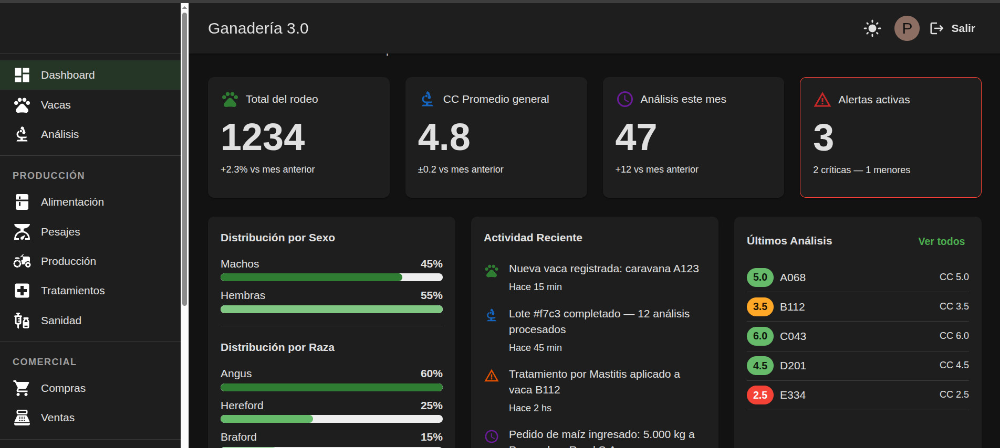
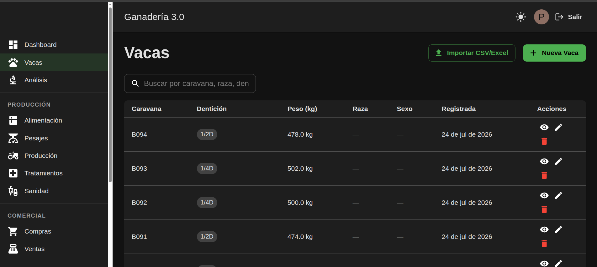
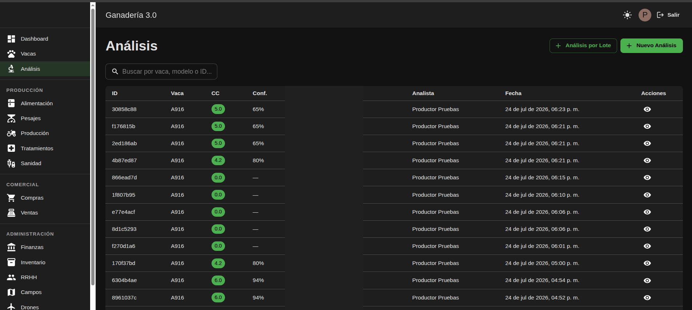
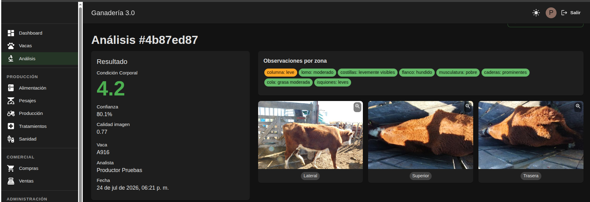

# Ganadería 3.0

> Repositorio público de arquitectura y documentación. El código fuente es privado — proyecto en desarrollo bajo contrato de colaboración con el INTA.

Plataforma integral de gestión ganadera con módulo de **análisis de Condición Corporal (CC) mediante visión por computadora**. Desarrollado en colaboración con el **Instituto Nacional de Tecnología Agropecuaria (INTA)**, orientado a la industria bovina.

---

## Stack

**Back-end**


**Front-end**


**IA & Computer Vision**


**Infraestructura**


---

## El problema

La estimación de la **Condición Corporal (CC)** del ganado bovino es un indicador clave del estado nutricional del animal. Tradicionalmente se realiza de forma manual por un especialista, lo que implica:

- Tiempo significativo por animal
- Variabilidad entre evaluadores
- Imposibilidad de escalar en rodeos grandes
- Sin registro histórico sistemático

**Ganadería 3.0** automatiza este proceso mediante análisis de imágenes, integrando el resultado dentro de una plataforma de gestión completa del establecimiento.

---

## El sistema

Plataforma web con dos capas bien diferenciadas:

### Gestión del establecimiento
Panel de administración completo para el productor:

| Módulo | Descripción |
|---|---|
| **Vacas** | Registro por caravana, raza, dentición, peso, sexo. Importación masiva CSV/Excel |
| **Análisis** | Historial de análisis de CC por animal, con confianza y fecha |
| **Alimentación** | Gestión de dietas y consumo |
| **Pesajes** | Registro histórico de peso por animal |
| **Producción** | Métricas productivas del rodeo |
| **Tratamientos** | Registro de intervenciones veterinarias |
| **Sanidad** | Seguimiento sanitario del rodeo |
| **Finanzas** | Control económico del establecimiento |
| **Inventario** | Gestión de insumos y stock |
| **RRHH** | Gestión del personal |
| **Campos** | Administración de lotes y campos |
| **Drones** | Integración con relevamientos aéreos |
| **Compras / Ventas** | Módulo comercial |

### Módulo de análisis de CC
El productor o analista carga imágenes del animal desde tres ángulos y el sistema devuelve:
- **Puntaje de Condición Corporal** (escala 1–9)
- **Nivel de confianza** del resultado
- **Observaciones por zona corporal** (columna, lomo, costillas, flanco, musculatura, caderas, cola, isquiones)
- Registro histórico por animal con trazabilidad completa

---

## Capturas

### Dashboard

*Vista general del rodeo: total de animales, CC promedio, análisis del mes y alertas activas.*

### Registro de vacas

*Listado con búsqueda, filtros e importación masiva desde CSV/Excel.*

### Historial de análisis

*Tabla de análisis con CC codificado por color y nivel de confianza por resultado.*

### Detalle de análisis

*Resultado completo: puntaje CC, confianza, calidad de imagen, observaciones por zona e imágenes del animal (lateral, superior, trasera).*

---

## Arquitectura

```
[ Cliente (browser) ]
        ↓
[ Nginx · proxy + TLS ]
        ↓                    ↓
[ Frontend React ]    [ Backend NestJS ]
                              ↓               ↓
                      [ PostgreSQL ]   [ Servicio IA · FastAPI ]
```

El módulo de IA corre como un **servicio independiente** en Python/FastAPI. El backend NestJS lo consume vía API interna — completamente desacoplado del resto del sistema. Esto permite actualizar, escalar o reemplazar el modelo sin tocar la plataforma de gestión.

---

## Decisiones de arquitectura

**¿Por qué servicio IA separado y no integrado en el backend?**
El ciclo de vida del modelo (entrenamiento, validación, actualización) es independiente del ciclo de la plataforma de gestión. Separarlos permite iterar el modelo sin afectar producción y escalar el servicio de inferencia de forma independiente.

**¿Por qué NestJS para el backend de gestión?**
Sistema con múltiples módulos, roles y reglas de negocio complejas. NestJS fuerza la separación `controller/service/DTO` y provee inyección de dependencias — necesario para mantener el código mantenible a medida que el sistema crece.

**¿Por qué FastAPI para el servicio de IA?**
Ecosistema Python nativo para machine learning. Alto rendimiento, tipado con Pydantic, documentación automática. Ideal para exponer modelos de inferencia como microservicio.

---

## Estado del proyecto

| Área | Estado |
|---|---|
| Plataforma de gestión (NestJS + React) | ✅ En desarrollo activo |
| Módulo de análisis de CC | ✅ En desarrollo activo |
| Servicio de IA (FastAPI) | ✅ En desarrollo activo |
| Contrato de colaboración INTA | 🔄 En proceso |
| App móvil | 📋 Planificada |

---

> **Nota:** El código fuente es privado. Este repositorio documenta arquitectura, contexto del problema y estado del proyecto.  
> Colaboración con el **INTA** — Instituto Nacional de Tecnología Agropecuaria, Argentina.
